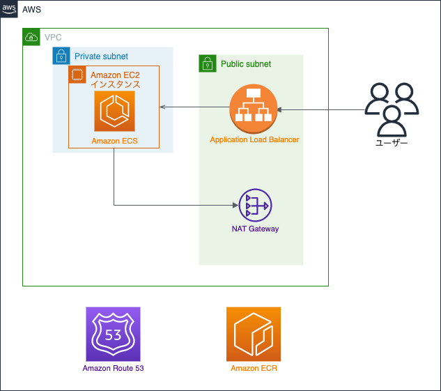

# 問 1-1
`architecture.png` は、AWS を利用する Web サービスを想定した構成図です。
ユーザーは Application Load Balancer（以下 ALB）を介して、Amazon EC2 インスタンス（以下 EC2 インスタンス）上で稼働する Web サービスを利用する事が出来ます。

`Terraform` フォルダには、構成図の条件を満たす AWS リソースを構築するための Terraform コードが入っています。
そのコードで作成される Web サービスに対し、下記の設問に最も適切な回答を記述して下さい。

## 小問 A
Terraform によって AWS リソースを作成後、 Amazon ECR にアプリケーションイメージのプッシュを行いました。しかし、イメージのプッシュ後しばらくしても Amazon ECS タスクが起動に成功しません。
起動に失敗したタスクの詳細をコンソールから見てみると、
```
CannotPullContainerError: Error response from daemon: pull access denied for 123456789012.dkr.ecr.ap-northeast-1.amazonaws.com/app, repository does not exist or may require ‘docker login’: denied: User: arn:aws:sts::123456789012:assumed-role/ecs
```
と表示されていました。Terraform コードに不備があったようです。

対応として考えられるものとして、最も適切なものを下記選択肢より選んでください。
### 選択肢 A
1. Amazon ECR リポジトリポリシーを追加し、Amazon ECS タスク実行ロールからのアクセス許可を追加する
2. Amazon EC2 インスタンスにアタッチされた IAM ロールに、Amazon ECR のイメージを取得するためのポリシーを追加する
3. Amazon ECR の VPC エンドポイントを作成する。エンドポイントのセキュリティグループは Amazon EC2 インスタンスが置かれたサブネットからのアクセスを許可するように設定する

※これより後の設問では、小問 A の対策を Web サービスに行った状態とします。
## 小問 B
Web サービス稼働後、EC2 インスタンスのうち 1 台が予期せず停止してしまいました。
インスタンスをホストしている基盤となるハードウェアに障害が発生したのが原因との事です。

Web サービスについて、障害後の状態として最も適切なものを選んでください。<br>
（※ 停止とは Web サービスに対する**全ての**リクエストに対して、200 番台のレスポンスが返されていない状態を示します）
### 選択肢 B
1. Web サービスが停止される事はない
2. Web サービスが一時的に停止されるが、自動的に復旧する
3. Web サービスが完全に停止し、復旧作業を行わなければ復旧する事はない

## 小問 C
Web サービス稼働後、EC2 インスタンスが存在するアベイラビリティーゾーンの 1 つに障害が発生し、該当するゾーンに存在する EC2 インスタンスが停止し、新たな EC2 インスタンスの起動が出来なくなりました。

Web サービスについて、障害後の状態として最も適切なものを選んでください。<br>
（※ 停止とは Web サービスに対する**全ての**リクエストに対して、200 番台のレスポンスが返されていない状態を示します）
### 選択肢 C
1. Web サービスが停止される事はない
2. Web サービスが一時的に停止されるが、自動的に復旧する
3. Web サービスが完全に停止し、復旧作業を行わなければ復旧する事はない

# 問 1-2
`問 1-1` 同様の構成図、 Terraform コードに関する下記の設問に最も適切な回答を記述して下さい。

## 小問 A
Web サービスの運用コスト削減のため、現在使用している EC2 インスタンスを一部スポットインスタンスに変える事にしました。
`Terraform/ec2.tf` を `ASG_Spot/ec2_with_spot<1〜3>.tf` のどれかに差し替える場合、下記要件を満たした上で最もコストが削減出来ると期待される Terraform のコードを選んでください。
```
1. スポットインスタンスの中断により、EC2 インスタンスが入れ替わる時でも EC2 インスタンスが 1 台は最低でも起動している状態でなければいけません。
2. インスタンスタイプは下記表にあるものであればどのタイプでも問題ありません。
3. インスタンスタイプ毎のオンデマンド料金は[1]を参考にして下さい。リージョンは Terraform コードに準ずるものとします。
```
### 選択肢 A
1. `ec2_with_spot1.tf`
2. `ec2_with_spot2.tf`
3. `ec2_with_spot3.tf`

|  インスタンスタイプ  |
| ---- |
| m5.large |
| m5.xlarge |
| m5.2xlarge |
| m5.4xlarge |

## 構成図


## 注意事項
* Amazon ECR へのコンテナイメージのデプロイは Terraform apply の直後に自動で行われ、アプリケーションコード起因のエラーは発生しないとします
* Web サービスに必要な設定は`問 1-1 小問 A`のエラーを除いて全て行われているものとします
* 問題で取り扱う Terraform コードは Terraform v1.0.0 を用いて実行される事を想定しています

## Appendix
* [1] <https://aws.amazon.com/ec2/pricing/on-demand/>
