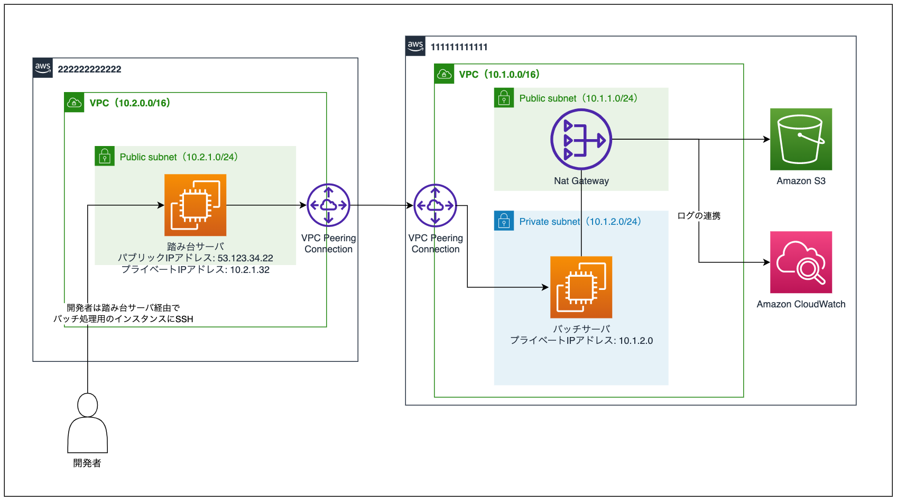

# 問 1-1

以下の問題文を読み、小問に回答してください。

AWS アカウントの Amazon EC2 インスタンス上で定期実行するバッチ処理を開発することになりました。

インフラに関連する要件としては、次のような項目があります。

- AWS アカウント（111111111111）の Amazon VPC（以下 VPC）にある Amazon EC2 インスタンス上でバッチを実行（以下このインスタンスをバッチサーバと呼称）
  - バッチサーバはプライベートサブネット上に構築し、NAT ゲートウェイを経由してインターネットと通信をします
  - 別 AWS アカウント（222222222222）に存在するインスタンス（以下踏み台サーバと呼称）からバッチサーバへの SSH を許可
- バッチサーバで設定した cron によりバッチ処理が定期的に起動し、同じアカウントにある Amazon S3 バケット（以下 S3 バケット）へアクセスします。またログは Amazon CloudWatch Logs（以下 CloudWatch Logs）に連携します
  - バッチ処理において、S3/CloudWatch Logs 以外へのアウトバウンド通信は必要としません
- バッチサーバの稼働する VPC と踏み台サーバが稼働する VPC は VPC Peering Connection で接続されています

構築予定のインフラ構成は以下の通り。



## 小問 A

いずれのサブネットについても、接続先 VPC へのトラフィックを VPC Peering Connection に送信するとした場合、AWS アカウント（111111111111）の各サブネットにアタッチするルートテーブルの Terraform コードは次のように書けます。
（なお、`aws_internet_gateway.this` や `aws_vpc_peering_connection.this` は問題の条件を満たすよう既に定義されているとします）

（A-a）〜（A-c）に最も適切だと考えられる選択肢を選んでください。
ひとつの選択肢が複数回使われることも、一度も使われないこともあります。

```
resource "aws_route_table" "public" {
  vpc_id = ...

  route {
    cidr_block = "(A-a)"
    gateway_id = aws_internet_gateway.this.id
  }

  route {
    cidr_block                = "10.2.0.0/16"
    vpc_peering_connection_id = aws_vpc_peering_connection.this.id
  }
}

resource "aws_route_table" "private" {
  vpc_id = ...

  route {
    cidr_block     = "(A-b)"
    nat_gateway_id = aws_nat_gateway.this.id
  }

  route {
    cidr_block                = "(A-c)"
    vpc_peering_connection_id = aws_vpc_peering_connection.this.id
  }
}
```

### 選択肢 A
1. 0.0.0.0/0
2. 10.1.0.0/16
3. 10.2.0.0/16
4. 53.123.34.22/32

## 小問 B

バッチサーバにアタッチする Security Group の ID を `sg-11111111`、踏み台サーバにアタッチする Security Group の ID を `sg-22222222` とします。
以下の選択肢のうち、踏み台サーバからバッチサーバにポート 22 番で SSH を許可する要件を満たす Security Group Rule として適切な Terraform コードを全て選んでください。

### 選択肢 B

1.
```
resource "aws_security_group_rule" "rule_1" {
  type              = "ingress"
  security_group_id = "sg-11111111"
  from_port         = 22
  to_port           = 22
  protocol          = "tcp"
  cidr_blocks       = ["10.2.1.32/32"]
}
```

2.
```
resource "aws_security_group_rule" "rule_2" {
  type              = "ingress"
  security_group_id = "sg-11111111"
  from_port         = 22
  to_port           = 22
  protocol          = "tcp"
  cidr_blocks       = ["53.123.34.22/32"]
}
```

3.
```
resource "aws_security_group_rule" "rule_3" {
  type                     = "ingress"
  security_group_id        = "sg-11111111"
  from_port                = 22
  to_port                  = 22
  protocol                 = "tcp"
  source_security_group_id = "222222222222/sg-22222222"
}
```

4.
```
resource "aws_security_group_rule" "rule_4" {
  type              = "ingress"
  security_group_id = "sg-11111111"
  from_port         = 22
  to_port           = 22
  protocol          = "tcp"
  cidr_blocks       = ["10.2.1.0/24"]
}
```

# 問 1-2

問題文の続きを読み、小問に回答してください。

## 小問 A

ネットワーク周りの構築が完了したので、バッチサーバからインターネットへの通信をテストすることにしました。
以下の文章における（A-a）〜（A-c）に最も適切だと考えられる選択肢を選んでください。

踏み台サーバを経由してバッチサーバに SSH し、インターネットへのアクセスが可能かを確認するために、`ping` コマンドを実行することにしました。
`ping` は（A-a）プロトコルを使用したネットワーク診断のプログラムです。
（A-a）は OSI 参照モデルでは（A-b）に分類され、ネットワークのトラブルシューティングにおいて良く利用されます。
`ping 8.8.8.8`を実行したところ応答がありました。そこで、インターネットへの接続設定は問題なさそうだと判断できます。

ただ、念のため `traceroute` コマンドで通信の経路も確認することにしました。要件通り構築ができていれば、`traceroute` コマンドの結果には NAT ゲートウェイの（A-c）も含まれるはずだからです。

### 選択肢 A
1. TCP
2. UDP
3. プライベート IP アドレス
4. パブリック IP アドレス
5. トランスポート層
6. アプリケーション層
7. ネットワーク層
8. データリンク層
9. ICMP
